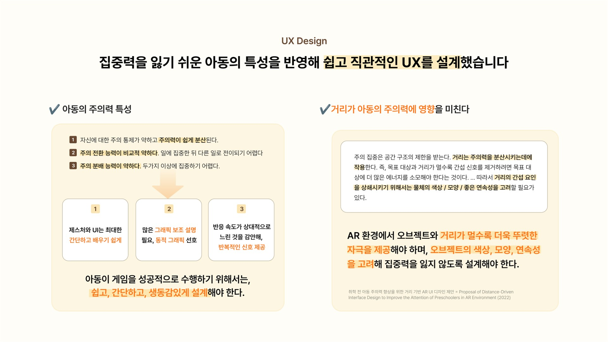
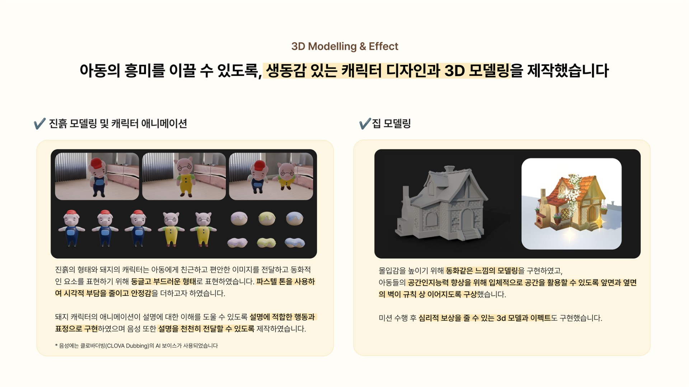
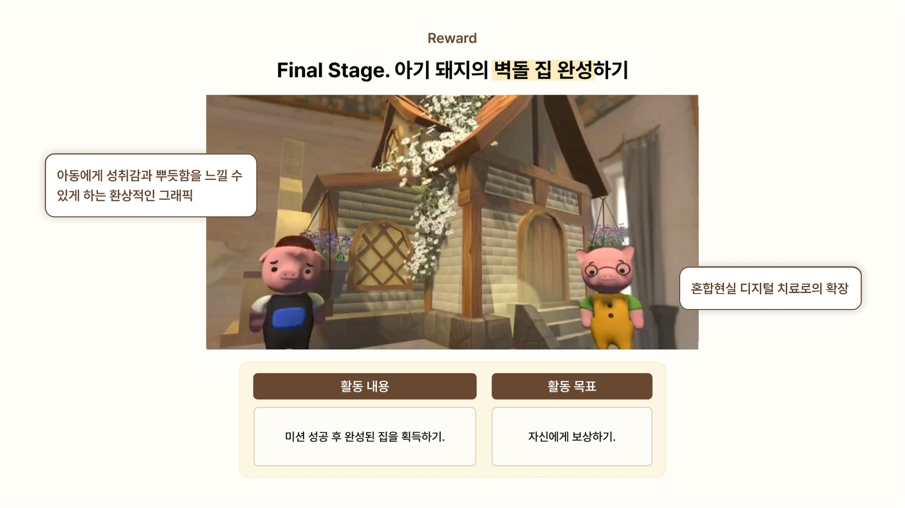
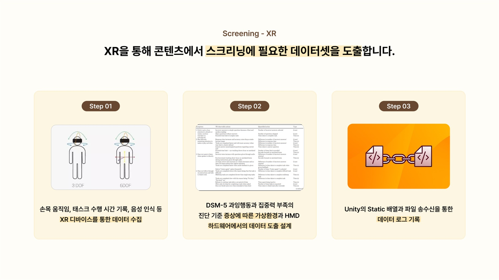
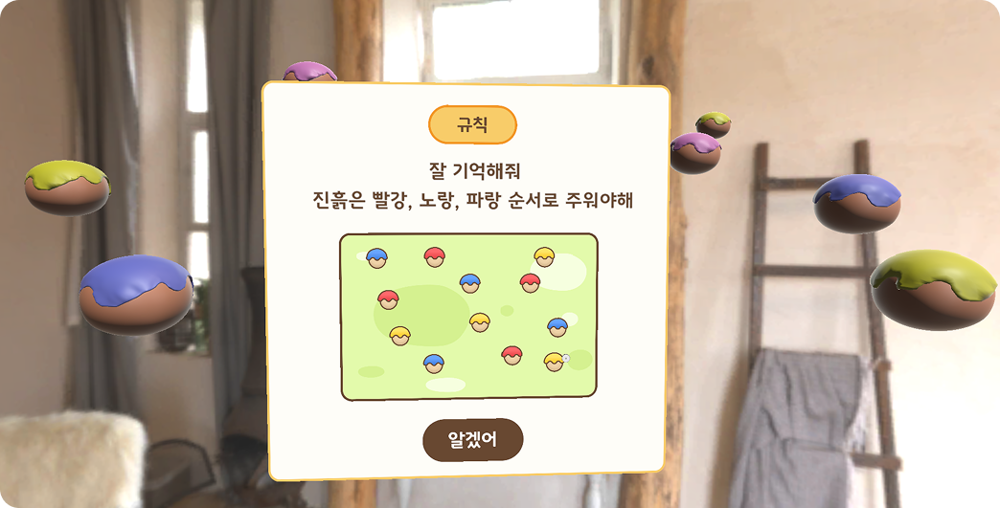
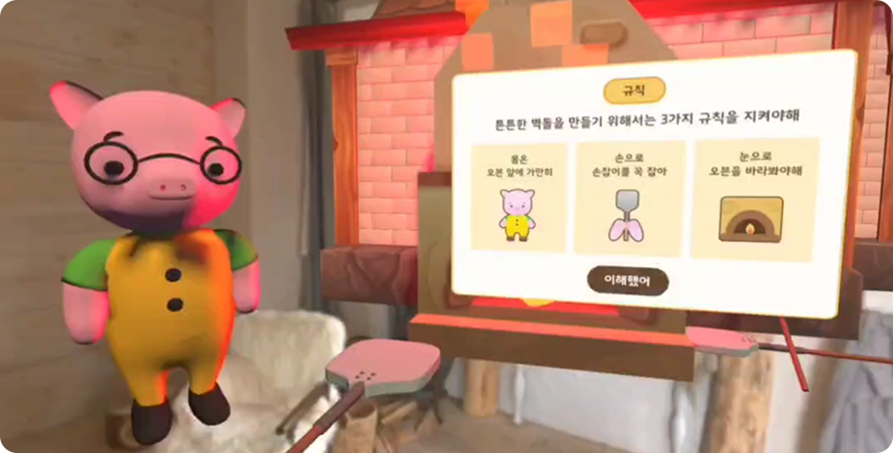

# 🐷 i-There

🏠 i-There is an **AR game for children with ADHD**, inspired by The Three Little Pigs. Kids join a cute baby pig character to collect materials, bake bricks, and build a house—enjoying pastel-toned environments, intuitive interactions, and 3D effect rewards without feeling like they're being tested. Meanwhile, AI analyzes the child's gaze, movement, and voice patterns to screen for ADHD symptoms and dynamically adjusts behavioral training content difficulty based on each child's profile.

🏠 i-There는 아기돼지 삼형제 이야기를 모티프로 한 **ADHD 아동을 위한 AR 게임**입니다. 아이들은 귀여운 아기 돼지 캐릭터와 함께 재료를 모으고 벽돌을 구워 집을 완성하는 게임 속에서, 파스텔톤 공간과 직관적인 인터랙션, 3D 이펙트 보상을 통해 검사받는다는 느낌 없이 신나게 놀 수 있습니다. 그 사이 AI가 아이의 시선, 움직임, 음성 패턴 등을 분석해 ADHD 증상을 스크리닝하고 증상 정도에 따라 행동 발달 훈련 콘텐츠의 난이도를 개인별로 조정해줍니다.

---

## 📋 Table of Contents

1. [🎯 Overview](#-overview)
2. [🐷 Game Description](#-game-description)
3. [🎮 How to Play](#-how-to-play)
4. [📎 Appendix: Implementation Details](#-appendix-implementation-details)

---

  
## Overview

### 📖 Introduce

**Name**: i-There  
**Duration**: 2024.07 ~ 2024.12  
     
  |     |    

 

### 👥 Team

| Position | Role | Name | University & Major |
|:--|:--|:--|:--|
| 🎯 Team Leader | PM & Lead Dev | Jaehyun Byun | Kyung Hee Univ. Computer Science |
| 📋 Planning | Level Designer & Game Planner | Yerim Lee | Ewha Womans Univ. Convergent Contents |
| 📋 Planning | Business Model Planner | Soonmin Kwon | Konkuk Univ. Media Communication |
| 💻 Dev | Game Client Developer | Seyoung Park | Hongik Univ. Computer Science |
| 💻 Dev | AI Model Dev & Medical Specialist | Wookhee Won | Seoul National Univ. Medicine |
| 🎨 Art | UI/UX Designer | Chowon Jeong | Hongik Univ. Painting |
| 🎨 Art | 3D Artist | Yeji Park | Hongik Univ. Ceramics & Glass |
| 🎨 Art | Graphic Designer | Suyeon Lee | Sookmyung Women's Univ. Biological Sciences |

 

## 🐷 Game Description

  
### Background

  
  

 

ADHD affects about 7.6% of children globally, and early intervention is crucial—yet current diagnoses rely on subjective assessments that can feel burdensome for kids. i-There lets children enjoy an AR adventure building a house with the Three Little Pigs, while AI quietly collects behavioral data to objectively screen for ADHD symptoms.

ADHD는 전 세계 아동의 약 7.6%에게 영향을 미치며, 조기 진단과 개입이 중요합니다. 하지만 현재 진단은 주관적 평가에 의존하고, 아이들은 '정신과 검사'라는 과정에서 심리적 부담을 느끼기 쉽습니다. i-There는 증강 현실의 **아기돼지 삼형제의 집짓기 모험 속에서 아이들이 신나게 놀면서, AI가 자연스럽게 행동 데이터를 수집하고 ADHD 증상을 객관적으로 분석하는 게임 솔루션**입니다.

### Game Design & Art and Visual

  
  

 

Inspired by The Three Little Pigs, kids collect clay, bake bricks, and build a house with adorable pig friends. Each mission—gathering materials in order, watching the oven, stacking bricks by rules—naturally trains sequential memory, sustained attention, and rule execution. Friendly pig characters guide with voice prompts, encourage on mistakes, and celebrate clears with 3D effects. Pastel colors, rounded characters, and a storybook world make it feel like a playground, not a clinic.

**아기돼지 삼형제의 집짓기 모험을 모티프로, 아이들이 귀여운 돼지 친구들과 함께 재료를 모으고, 벽돌을 굽고, 직접 집을 완성해가는 여정을 설계**했습니다. 색깔별 진흙을 순서대로 줍고, 오븐 앞에서 벽돌이 잘 구워지는지 지켜보고, 규칙에 맞게 벽돌을 쌓는 3단계 미션 속에서 아이들은 자연스럽게 순서 기억, 집중 유지, 규칙 실행을 훈련하게 됩니다. 돼지 캐릭터가 음성으로 다정하게 안내하고, 실수하면 "다시 생각해보자!"라며 격려해주고, 미션을 클리어하면 화려한 3D 이펙트와 함께 성취감을 느낄 수 있습니다. **파스텔톤 색상과 둥글둥글한 캐릭터, 동화 속 공간 덕분에 아이들은 검사실이 아닌 놀이터에 온 것처럼 신나게 게임에 빠져들게 됩니다.**

### Development

  
  

- **Client:** Unity 엔진 기반으로 기획서의 3단계 미션 시나리오와 레벨 디자인을 게임플레이로 구현했습니다. 디자인팀의 캐릭터·배경 시안을 적용하고, Naver Clova API를 활용한 음성 상호작용, UI 미니맵, 색상 순서 퍼즐 및 벽돌 쌓기 게임 로직, Pinch/Grab 제스처 인터랙션, 미션 클리어 시 3D 이펙트 연출을 개발했습니다.  
- **AI**: DSM-5 기반 ADHD 진단 기준 18개 항목을 디지털 지표로 변환하고, 수집된 행동 데이터를 CNN 모델로 학습하여 증상을 정량적으로 분류합니다. PyTorch로 학습한 모델을 ONNX로 변환 후 Unity Barracuda에 통합하여 온디바이스 실시간 추론을 구현했으며, 분석 결과에 따라 훈련 콘텐츠의 난이도를 동적으로 조정합니다.  
- **Backend**: 핸드트래킹, 아이트래킹, IMU 센서로 수집된 시선, 손 움직임, 머리 회전 등 다차원 행동 데이터를 전처리하고, REST API를 통해 서버로 전송합니다. MariaDB에 사용자별 스크리닝 결과와 세션 기록을 저장하여 개인별 증상 프로파일 관리와 장기 추적이 가능합니다.

## 🎮 How to Play

  
  
  

> ⚠️ This game was developed using [Metacore SDK](https://github.com/PnCSolution/MetacoreSDK) and runs exclusively on **METALENSE2** XR glasses.

- **Step 1:** 진흙 줍기 🧱  
아기 돼지와 처음 만나 대화를 나누면 큰 형 돼지가 지도를 보여주며 빨강 → 노랑 → 파랑 순서로 진흙을 주우라고 안내합니다. 미니맵을 참고해 공간을 이동하며 Pinch 제스처로 진흙을 순서대로 수집하세요. 잘못된 색을 집으면 "지금은 이 색 차례가 아니야!"라고 알려줍니다. 이동 경로와 실수 횟수가 기록되어 ADHD 증상 정도를 스크리닝하고, 이후 단계의 난이도를 결정합니다.
- **Step 2:** 진흙 굽기 🔥  
작은 형 돼지와 함께 오븐 앞에서 진흙이 벽돌로 구워지는 것을 지켜봅니다. 오븐을 손으로 잡고 가만히 집중해야 해요. 고개를 돌리거나 손을 움직이면 진동 피드백과 함께 "진흙이 탈 수 있어!"라고 경고합니다. 시선 이탈 시간과 손목 움직임 데이터가 수집되어 주의 지속력을 측정합니다.
- **Step 3:** 집 만들기 🏠  
구워진 벽돌을 색상 규칙에 맞게 쌓아 집을 완성합니다. "빨간 벽돌은 노란 벽돌보다 왼쪽에!" 같은 규칙을 기억하고 Grab 제스처로 벽돌을 배치하세요. 규칙을 어기면 "다시 생각해보자!"라며 격려해주고, AI 스크리닝 결과에 따라 벽돌 개수와 허용 실수 횟수가 개인별로 조정됩니다. 모든 미션을 클리어하면 화려한 3D 이펙트와 함께 멋진 벽돌집이 완성됩니다! 🎉
