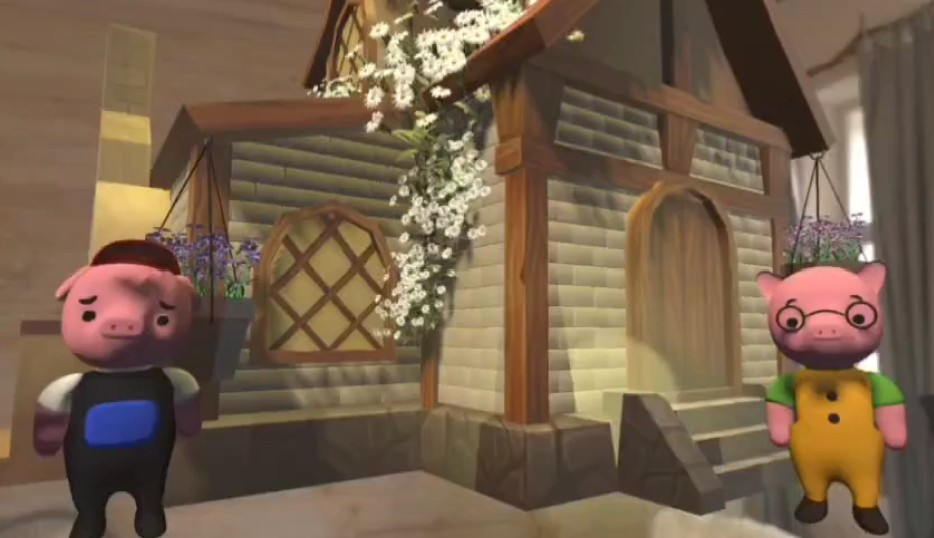
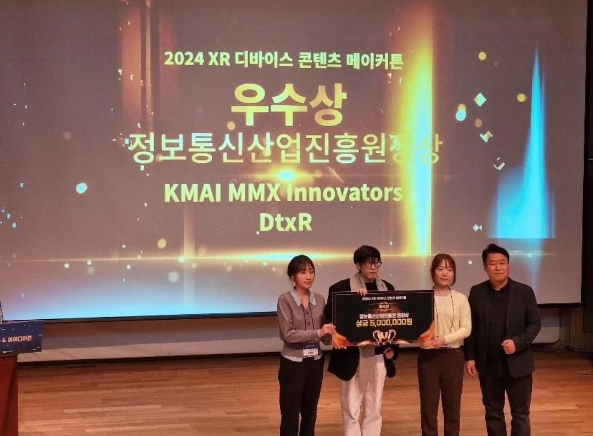

# 🐷 i-There

  

> *"Build a house with the Three Little Pigs!" "아기돼지 삼형제와 함께 집을 지어요! 🐷🏠" "*  
> *While child plays, AI screens for ADHD symptoms. 놀이처럼 즐기는 사이, AI가 ADHD 증상을 살펴봐요.*

🏠 i-There is an **AR game for children with ADHD**, inspired by The Three Little Pigs. Kids join a cute baby pig character to collect materials, bake bricks, and build a house—enjoying pastel-toned environments, intuitive interactions, and 3D effect rewards without feeling like they're being tested. Meanwhile, AI analyzes the child's gaze, movement, and voice patterns to screen for ADHD symptoms and dynamically adjusts behavioral training content difficulty based on each child's profile.

 

🏠 i-There는 아기돼지 삼형제 이야기를 모티프로 한 **ADHD 아동을 위한 AR 게임**입니다. 아이들은 귀여운 아기 돼지 캐릭터와 함께 재료를 모으고 벽돌을 구워 집을 완성하는 게임 속에서, 파스텔톤 공간과 직관적인 인터랙션, 3D 이펙트 보상을 통해 검사받는다는 느낌 없이 신나게 놀 수 있습니다. 그 사이 AI가 아이의 시선, 움직임, 음성 패턴 등을 분석해 ADHD 증상을 스크리닝하고 증상 정도에 따라 행동 발달 훈련 콘텐츠의 난이도를 개인별로 조정해줍니다.

---

## 📋 Table of Contents

1. [🎯 Overview](#-overview)
2. [🐷 Game Description](#-game-description)
3. [🎮 How to Play](#-how-to-play)
4. [🎪 Live Demo & Award](#-live-demo--award)

---

  
## 🎯 Overview

### 📖 Introduce

**Name**: i-There  
**Duration**: 2024.07 ~ 2024.12  
     
  |     |    

 

### 👥 Team

| Position | Role | Name | University & Major |
|:--|:--|:--|:--|
| 🎯 Team Leader | PM & Lead Dev | Jaehyun Byun | Kyung Hee Univ. Computer Science |
| 📋 Planning | Level Designer & Game Planner | Yerim Lee | Ewha Womans Univ. Convergent Contents |
| 📋 Planning | Business Model Planner | Soonmin Kwon | Konkuk Univ. Media Communication |
| 💻 Dev | Game Client Developer | Seyoung Park | Hongik Univ. Computer Science |
| 💻 Dev | AI Model Dev & Medical Specialist | Wookhee Won | Seoul National Univ. Medicine |
| 🎨 Art | UI/UX Designer | Chowon Jeong | Hongik Univ. Painting |
| 🎨 Art | 3D Artist | Yeji Park | Hongik Univ. Ceramics & Glass |
| 🎨 Art | Graphic Designer | Suyeon Lee | Sookmyung Women's Univ. Biological Sciences |

---

 

## 🐷 Game Description

  
### Background

  
  

 

ADHD affects about 7.6% of children globally, and early intervention is crucial—yet current diagnoses rely on subjective assessments that can feel burdensome for kids. i-There lets children enjoy an AR adventure building a house with the Three Little Pigs, while AI quietly collects behavioral data to objectively screen for ADHD symptoms.

ADHD는 전 세계 아동의 약 7.6%에게 영향을 미치며, 조기 진단과 개입이 중요합니다. 하지만 현재 진단은 주관적 평가에 의존하고, 아이들은 '정신과 검사'라는 과정에서 심리적 부담을 느끼기 쉽습니다. i-There는 증강 현실의 아기돼지 삼형제의 집짓기 모험 속에서 아이들이 신나게 놀면서, AI가 자연스럽게 행동 데이터를 수집하고 ADHD 증상을 객관적으로 분석하는 게임 솔루션입니다.

 

### Game Design & Art

  
  

Inspired by The Three Little Pigs, kids become the little pig's helper—collecting clay, baking bricks, and stacking colorful walls to build a house. Child-friendly interface, tactile interactions, gentle voice guidance, and cheerful rewards drive engagement, while the game quietly measures and trains core ADHD cognitive functions.

아기돼지 삼형제 이야기를 모티프로, 아이들은 아기 돼지의 조력자가 되어 진흙을 모으고, 벽돌을 굽고, 알록달록한 벽을 쌓아 집을 완성합니다. 아동을 위한 쉬운 인터페이스, 실제 사물을 다루는 듯한 인터랙션, 다정한 음성 안내와 신나는 보상이 몰입을 이끌며 게임은 그 사이 ADHD 핵심 인지 기능을 자연스럽게 측정하고 훈련합니다.

| Element | Description |
|:--|:--|
| **Art Direction** | Storybook-inspired pastel palette, soft lighting, child-friendly rounded silhouettes 동화풍 파스텔 팔레트, 소프트 라이팅, 아동 친화적 라운드 실루엣 |
| **3D Modeling** | Stylized low-poly pig characters & props in Blender, optimized for XR performance Blender 기반 스타일라이즈드 로우폴리 캐릭터·소품, XR 퍼포먼스 최적화 |
| **Animation** | Idle/reaction animations with squash & stretch, particle-based 3D VFX on mission clear 스쿼시&스트레치 적용 Idle/리액션 애니메이션, 미션 클리어 시 파티클 기반 3D VFX |
| **UX Design** | Diegetic voice guidance, positive reinforcement on errors, spatial UI with minimap 다이제틱 음성 안내, 실수 시 음성 피드백, 미니맵 기반 공간 UI |

 

### Development

  
  

 

**Client**: Implemented 3-stage mission scenarios and level design in Unity. Integrated character/environment assets from the design team, voice interaction via Naver Clova API, minimap UI, color-sequence puzzles, brick-stacking logic, Pinch/Grab gesture interactions, and 3D VFX on mission clear.    
Unity 엔진 기반 3단계 미션 시나리오 및 레벨 디자인 구현. 디자인팀 캐릭터·배경 시안 적용, Naver Clova API 음성 상호작용, 미니맵 UI, 색상 순서 퍼즐, 벽돌 쌓기 로직, Pinch/Grab 제스처 인터랙션, 미션 클리어 시 3D 이펙트 연출. 

**AI**: Converted DSM-5 ADHD diagnostic criteria (18 items) into digital metrics. Trained CNN model on behavioral data for quantitative symptom classification. Exported PyTorch model to ONNX, integrated with Unity Barracuda for on-device real-time inference, dynamically adjusting difficulty based on results.    
DSM-5 기반 ADHD 진단 기준 18개 항목 디지털 지표 변환. CNN 모델로 행동 데이터 학습 및 증상 정량 분류. PyTorch → ONNX 변환 후 Unity Barracuda 통합, 온디바이스 실시간 추론 및 난이도 동적 조정.

**Backend**: Preprocessed multi-dimensional behavioral data (gaze, hand movement, head rotation) from hand/eye tracking and IMU sensors. Transmitted via REST API, stored per-user screening results and session logs in MariaDB for symptom profiling and long-term tracking.      
핸드·아이트래킹, IMU 센서 기반 시선·손 움직임·머리 회전 등 다차원 행동 데이터 전처리. REST API 서버 전송, MariaDB에 사용자별 스크리닝 결과 및 세션 기록 저장으로 개인 프로파일 관리 및 장기 추적.  

 

---

## 🎮 How to Play

> ⚠️ This game was developed using [Metacore SDK](https://github.com/PnCSolution/MetacoreSDK) and runs exclusively on **METALENSE2** XR glasses.

| | 🧱 Mission 1: Collect the Clay | 🔥 Mission 2: Bake the Bricks | 🏠 Mission 3: Build the House |
|:--:|:--|:--|:--|
| |  |  |  |
| **Goal** | Collect clay in assigned order 정해진 순서대로 진흙 수집 | Stay focused until bricks are baked 벽돌이 구워질 때까지 집중 | Stack bricks by color rules 색상 규칙에 맞게 벽돌 쌓기 |
| **Interaction** | Minimap + gesture to collect 미니맵 관찰 + 제스처 수집 | Hold oven, maintain gaze 오븐 잡고 시선 유지 | Grab gesture to place 그랩 제스처로 배치 |
| **Backend** | Measures working memory & executive function 작업 기억 및 실행 기능 측정 | Measures self-regulation & attention 자기조절력 및 집중력 측정 | Adjusts behavioral training difficulty 행동발달 콘텐츠 난이도 조정 |

---

 

## 🎪 Live Demo & Award

  
  
  

  

2024년 11월 판교 메타버스 허브에서 열린 XR 디바이스 콘텐츠 메이커톤 본선 발표. 심사위원들이 직접 플레이한 현장 시연에서 게임 플레이 플로우, 실시간 AI 스크리닝, 서버 연동까지 전 시스템이 안정적으로 구동되며 플레이어블 빌드의 완성도를 입증했습니다. 그 결과 최종 2위로 선정되며 정보통신산업진흥원장상과 상금 500만원을 수상했습니다.

 

  

i-There의 기술 기반 위에 아동학 교수, 정신과 전공의, 디지털 헬스케어 투자사 대표 인터뷰를 통해 사용자 니즈와 시장 타당성을 검증하고, '어린 왕자'의 유대와 자기 발견 서사를 게임 프레임워크로 재설계했습니다. 어린 왕자와의 대화, 장미 돌보기, 비행 연료 수집으로 이어지는 3단계 스크리닝 시퀀스와 왕의 행성, 상인의 행성 등 개인화된 행동 발달 미션을 설계하여 기획안과 디자인 프로토타입으로 정리, ACM CHI 2025 Student Design Competition 본선에 진출 후, 최종 4팀인 Finalist로 선정되었습니다.

