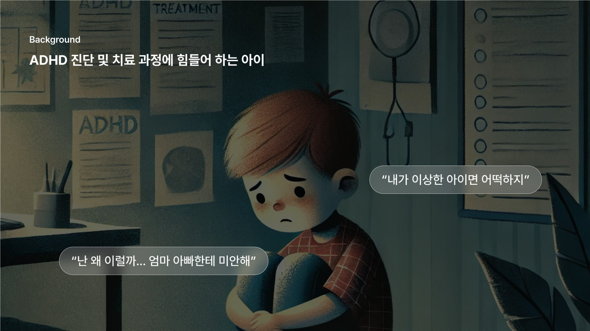
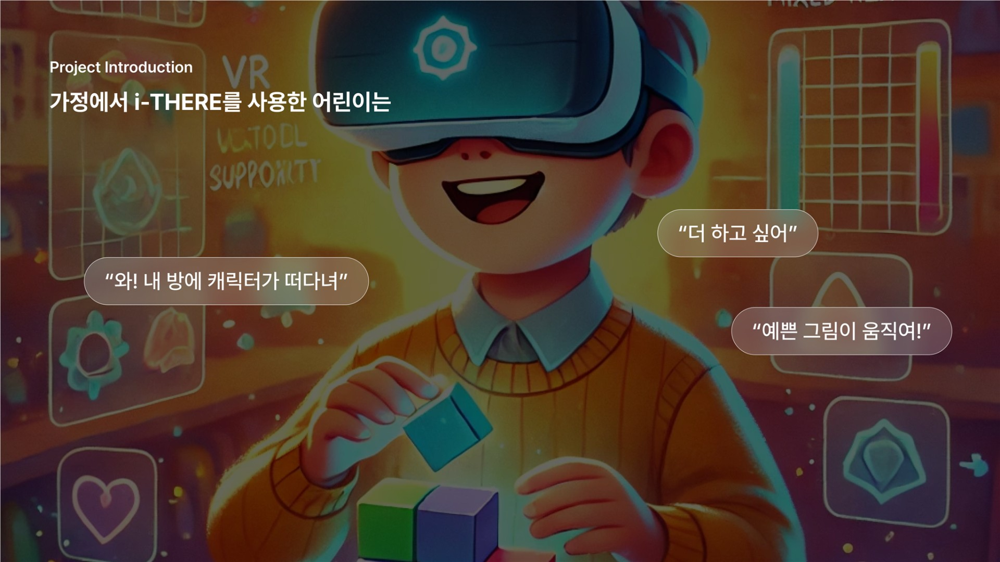
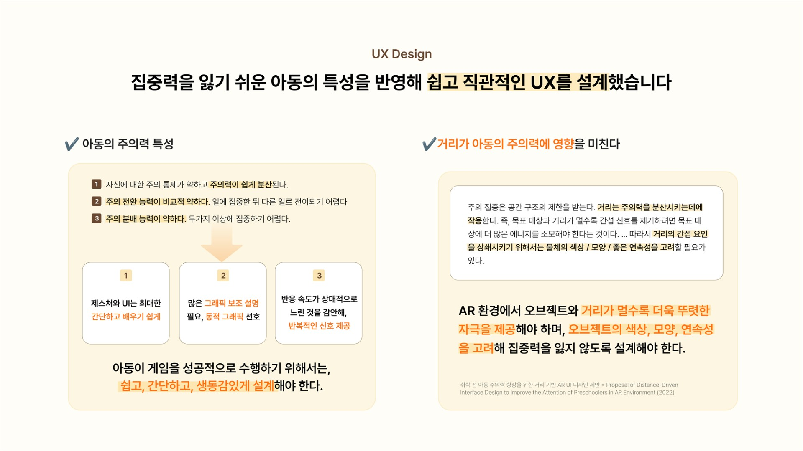
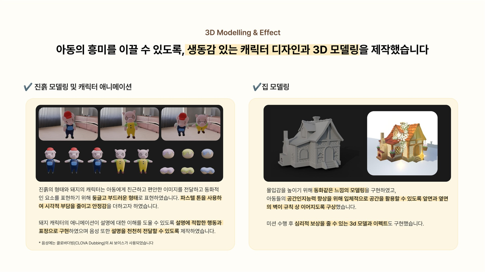
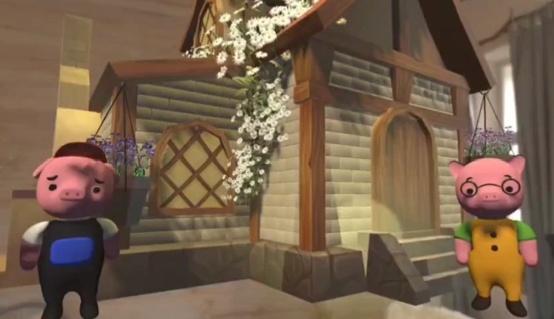
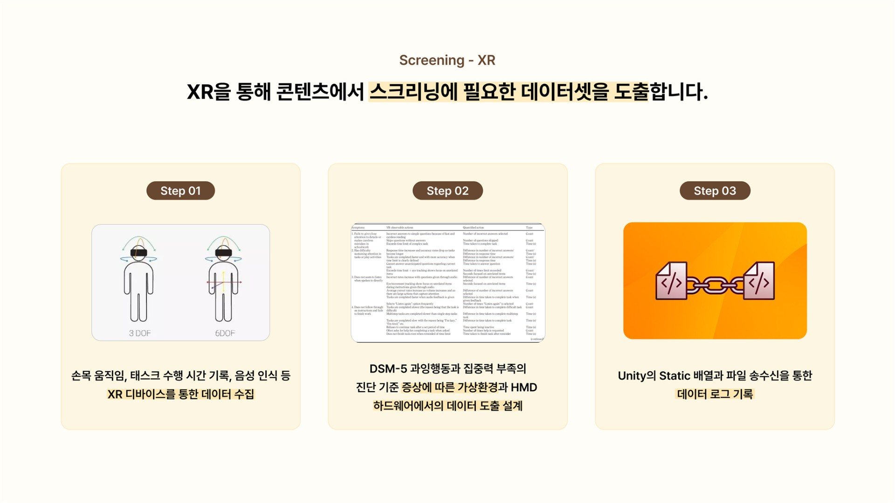
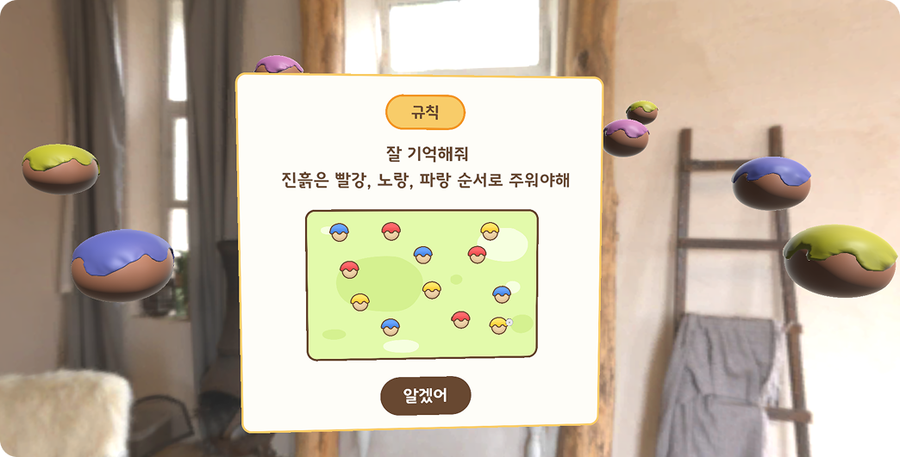
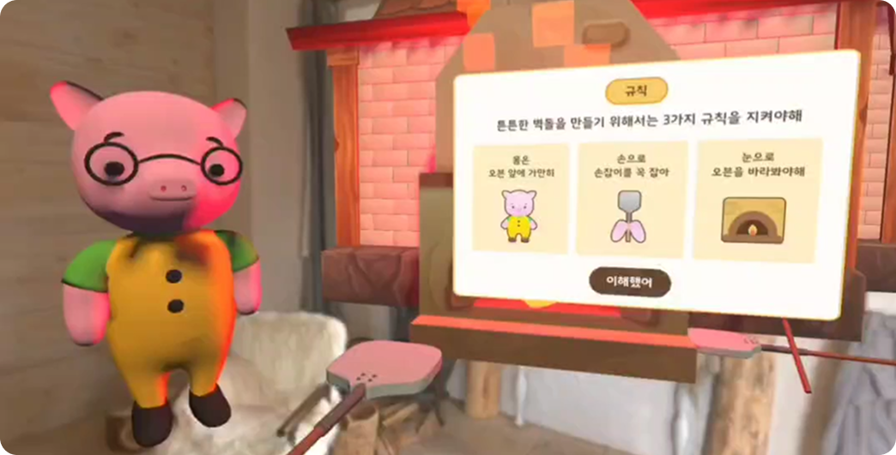
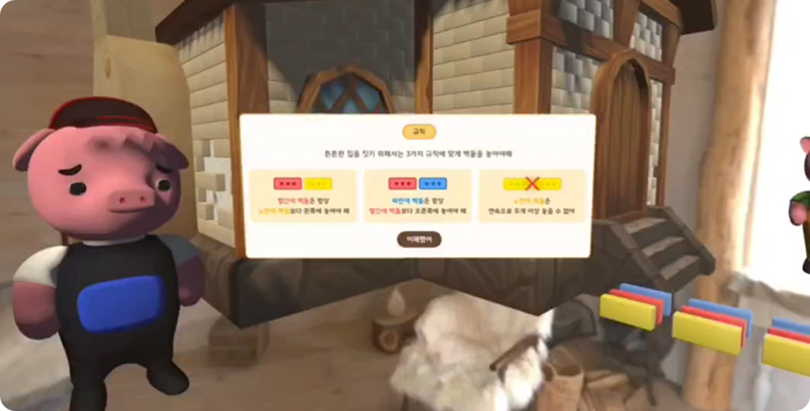
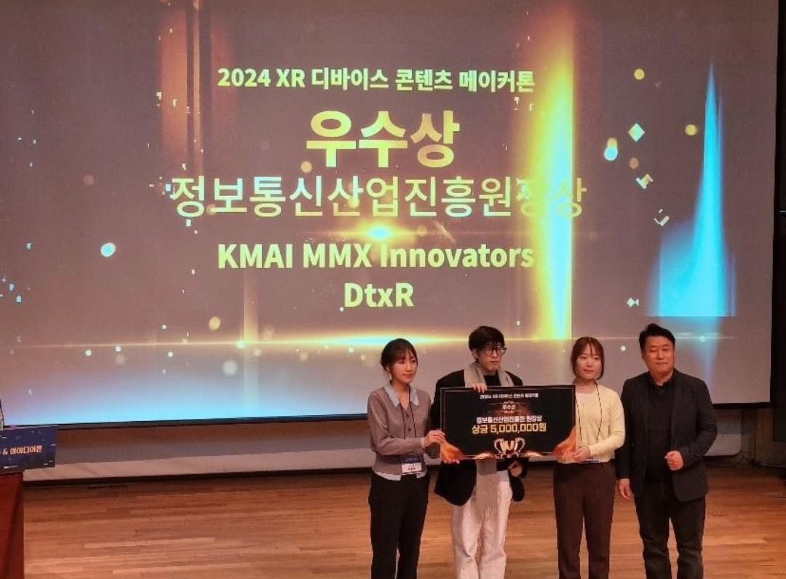

<div align="center">

# 🐷 i-There

  

> *"Build a house with the Three Little Pigs!" "아기돼지 삼형제와 함께 집을 지어요! 🐷🏠" "*  
> *While child plays, AI screens for ADHD symptoms. 놀이처럼 즐기는 사이, AI가 ADHD 증상을 살펴봐요.*
</div>

<br>

🏠 i-There is an **AR game for children with ADHD**, inspired by The Three Little Pigs. Kids team up with an adorable piglet to gather materials, bake bricks, and build a house—all within a pastel-toned world featuring intuitive interactions and 3D effect rewards that make play feel like play, not a test. Behind the scenes, AI analyzes gaze, movement, and voice patterns to screen for ADHD symptoms and dynamically adjusts training difficulty to each child's profile.

<br>

🏠 i-There는 아기돼지 삼형제 이야기를 모티프로 한 **ADHD 아동을 위한 AR 게임**입니다. 아이들은 귀여운 아기 돼지 캐릭터와 함께 재료를 모으고 벽돌을 구워 집을 완성하는 게임 속에서, 파스텔톤 공간과 직관적인 인터랙션, 3D 이펙트 보상을 통해 검사받는다는 느낌 없이 신나게 놀 수 있습니다. 그 사이 AI가 아이의 시선, 움직임, 음성 패턴 등을 분석해 ADHD 증상을 스크리닝하고 증상 정도에 따라 행동 발달 훈련 콘텐츠의 난이도를 개인별로 조정해줍니다.

---

<div align="center">

## 📋 Table of Contents

1. [🎯 Overview](#-overview)
2. [🐷 Game Description](#-game-description)
3. [🎮 How to Play](#-how-to-play)
4. [🎪 Live Demo & Award](#-live-demo--award)

---

</div>

<div align="center">
  
## 🎯 Overview

### 📖 Introduce

**Name**: i-There   
**Genre**: Serious Game   
**Platform**: METALENSE2   
**Duration**: 2024.07 ~ 2024.12    

     
  |     |    

<br>

### 👥 Team

| Position | Role | Name | University & Major |
|:--|:--|:--|:--|
| 🎯 Team Leader | PM & Lead Dev | [Jaehyun Byun](https://github.com/BynPlay) | Kyung Hee Univ.<br>Computer Science |
| 📋 Planning | Level Designer & Game Planner | Yerim Lee | Ewha Womans Univ.<br>Convergent Contents |
| 📋 Planning | Business Model Planner | Soonmin Kwon | Konkuk Univ.<br>Media Communication |
| 💻 Dev | Game Client Developer | [Seyoung Park](https://github.com/30isdead) | Hongik Univ.<br>Computer Science |
| 💻 Dev | AI Model Dev & Medical Specialist | [Wooky Won](https://github.com/wonwooky) | Seoul National Univ.<br>Medicine |
| 🎨 Art | UI/UX Designer | Chowon Jung | Hongik Univ.<br>Painting |
| 🎨 Art | 3D Artist | Yeji Park | Hongik Univ.<br>Ceramics & Glass |
| 🎨 Art | Graphic Designer | Suyeon Lee | Sookmyung Women's Univ.<br>Biological Sciences |

</div>

---

<br>

## 🐷 Game Description
<div align="center">
  
### Background

  
  
</div>

<br>

ADHD affects about 7.6% of children globally, and early intervention is crucial—yet current diagnoses rely on subjective assessments that can feel burdensome for kids. i-There lets children enjoy an AR adventure building a house with the Three Little Pigs, while AI quietly collects behavioral data to objectively screen for ADHD symptoms.

ADHD는 전 세계 아동의 약 7.6%에게 영향을 미치며, 조기 진단과 개입이 중요합니다. 하지만 현재 진단은 주관적 평가에 의존하고 아이들은 '정신과 검사'라는 과정에서 심리적 부담을 느끼기 쉽습니다. i-There는 증강 현실의 아기돼지 삼형제의 집짓기 모험 속에서 아이들이 신나게 놀면서, AI가 자연스럽게 행동 데이터를 수집하고 ADHD 증상을 객관적으로 분석하는 게임 솔루션입니다.

<div align="center">

<br>

### Game Design & Art

</div>

<p align="center">
  
  
</p>

Inspired by The Three Little Pigs, kids become the little pig's helper—collecting clay, baking bricks, and stacking colorful walls to build a house. Child-friendly interface, tactile interactions, gentle voice guidance, and cheerful rewards drive engagement, while the game quietly measures and trains core ADHD cognitive functions.

아기돼지 삼형제 이야기를 모티프로, 아이들은 아기 돼지의 조력자가 되어 진흙을 모으고, 벽돌을 굽고, 알록달록한 벽을 쌓아 집을 완성합니다. 아동을 위한 쉬운 인터페이스, 실제 사물을 다루는 듯한 인터랙션, 다정한 음성 안내와 신나는 보상이 몰입을 이끌며 게임은 그 사이 ADHD 핵심 인지 기능을 자연스럽게 측정하고 훈련합니다.

<div align="center">

<br>

| Element | Description |
|:--|:--|
| **Art Direction** | Storybook-inspired pastel palette, soft lighting, child-friendly rounded silhouettes<br>동화풍 파스텔 팔레트, 소프트 라이팅, 아동 친화적 라운드 실루엣 |
| **3D Modeling** | Stylized low-poly pig characters & props in Blender, optimized for XR performance<br>Blender 기반 스타일라이즈드 로우폴리 캐릭터·소품, XR 퍼포먼스 최적화 |
| **Animation** | Idle/reaction animations with squash & stretch, particle-based 3D VFX on mission clear<br>스쿼시&스트레치 적용 Idle/리액션 애니메이션, 미션 클리어 시 파티클 기반 3D VFX |
| **UX Design** | Diegetic voice guidance, positive reinforcement on errors, spatial UI with minimap<br>다이제틱 음성 안내, 실수 시 음성 피드백, 미니맵 기반 공간 UI |
<div align="center">

</div>

<br>

### Development

<div align="center">
  
  
</div>
</div>
<br>

#### 🎮 Client — Unity Application

Implemented 3-stage mission scenarios (collect clay → bake bricks → build house) in Unity. Designed child-friendly UX with Pinch/Grab gesture interactions, minimap-based spatial UI, Naver Clova API voice guidance, and particle-based 3D VFX on mission clear.

3단계 미션 시나리오(진흙 수집 → 벽돌 굽기 → 집 짓기)를 Unity에서 구현했습니다. Pinch/Grab 제스처 인터랙션, 미니맵 기반 공간 UI, Naver Clova API 음성 안내, 미션 클리어 시 파티클 기반 3D VFX까지 아동 친화적 UX를 설계했습니다.

#### 🧠 AI — On-device ADHD Screening

Converted DSM-5 ADHD diagnostic criteria (18 items) into digital behavioral metrics. CNN model learns temporal patterns from behavioral sequences. PyTorch → ONNX conversion enables on-device real-time inference via Unity Barracuda. Inference results (0~54 score) dynamically adjust Mission 3 difficulty.

DSM-5 기반 ADHD 진단 기준 18개 항목을 디지털 행동 지표로 변환했습니다. CNN 모델이 행동 시퀀스에서 시계열 패턴을 학습하고, tensorflow → ONNX 변환 후 Unity Barracuda로 온디바이스 실시간 추론을 수행합니다. 추론 결과(0~54점)에 따라 Mission 3의 난이도가 동적으로 조정됩니다.

> 🔗 **Reference**: [A Novel Approach to Diagnose ADHD Using Virtual Reality](https://link.springer.com/chapter/10.1007/978-3-030-63924-2_15)

#### 🗄️ Backend — Data Pipeline & Storage

Collects multi-dimensional behavioral data (gaze, hand movement, head rotation) from hand/eye tracking and IMU sensors. Memory-efficient processing via Unity Static arrays, followed by normalization and filtering. REST API transmits to server, MariaDB stores per-user screening results and session logs for long-term tracking and model improvement.

핸드/아이 트래킹과 IMU 센서에서 시선, 손 움직임, 머리 회전 등 다차원 행동 데이터를 수집합니다. Unity Static 배열로 메모리 효율적 처리 후 정규화 및 필터링을 거쳐 REST API로 서버에 전송, MariaDB에 사용자별 스크리닝 결과와 세션 로그를 저장하여 장기 추적 및 모델 개선에 활용합니다.

<div align="center">

#### 🔧 System Architecture
```
┌──────────────────┐    ┌──────────────────────────────────────┐    ┌──────────────────┐    ┌──────────────────┐
│   XR Device      │    │          Unity Client Engine         │    │   AI Inference   │    │     Backend      │
│   METALENSE2     │    │                                      │    │                  │    │                  │
├──────────────────┤    ├──────────────────────────────────────┤    ├──────────────────┤    ├──────────────────┤
│ • Hand Tracking  │    │  ┌──────────┐ ┌──────────┐ ┌──────┐  │    │ Barracuda CNN    │    │ REST API Server  │
│ • Eye Tracking   │───→│  │Mission 1 │→│Mission 2 │→│ M3   │  │───→│                  │───→│                  │
│ • IMU Sensor     │    │  │Clay      │ │Bricks    │ │Build │  │    │ DSM-5 18-Item    │    │ MariaDB          │
│ • Voice Input    │    │  │Collection│ │Baking    │ │House │  │    │ Scoring (0~54)   │    │ User Profiles    │
│ • Gameplay Data  │    │  └──────────┘ └──────────┘ └──┬───┘  │    │        │         │    │ Session Logs     │
│   (Time/Errors)  │    │                               ↑      │    │        ↓         │    │ Long-term Track  │
└──────────────────┘    │                Adaptive Difficulty   │    └──────────────────┘    └──────────────────┘
                        └──────────────────────────────────────┘
```

</div>

---

## 🎮 How to Play

> ⚠️ This game was developed using [Metacore SDK](https://github.com/PnCSolution/MetacoreSDK) and runs exclusively on **METALENSE2** XR glasses.

| | 🧱 Mission 1: Collect the Clay | 🔥 Mission 2: Bake the Bricks | 🏠 Mission 3: Build the House |
|:--:|:--|:--|:--|
| |  |  |  |
| **Goal** | Collect clay in assigned order<br>정해진 순서대로 진흙 수집 | Stay focused until bricks are baked<br>벽돌이 구워질 때까지 집중 | Stack bricks by color rules<br>색상 규칙에 맞게 벽돌 쌓기 |
| **Interaction** | Minimap + gesture to collect<br>미니맵 관찰 + 제스처 수집 | Hold oven, maintain gaze<br>오븐 잡고 시선 유지 | Grab gesture to place<br>그랩 제스처로 배치 |
| **Backend** | Measures working memory & executive function<br>작업 기억 및 실행 기능 측정 | Measures self-regulation & attention<br>자기조절력 및 집중력 측정 | Adjusts behavioral training difficulty<br>행동발달 콘텐츠 난이도 조정 |

---

<br>

## 🎪 Live Demo & Award

### 🏆 XR Device Content Makeathon — 2nd Place

<div align="center">
  
  
  

**November 2024 | Pangyo Metaverse Hub | Live Demo**

</div>

Presented at the XR Device Content Makeathon finals. During live demonstration where judges played hands-on, the full system—gameplay flow, real-time AI screening, and server integration—ran stable, proving the playable build's completeness. Awarded **2nd place with NIPA Director's Award and ₩5M prize**.

과학기술정보통신부 주최 XR 디바이스 콘텐츠 메이커톤 본선 발표. 심사위원들이 직접 플레이한 현장 시연에서 게임 플레이, 실시간 AI 스크리닝, 서버 연동까지 전 시스템이 안정적으로 구동되며 플레이어블 빌드의 완성도를 입증했습니다. **정보통신산업진흥원장상과 상금 500만원 수상**.

<br>

### 🌟 ACM CHI 2025 Student Design Competition — Finalist (Top 4)

<div align="center">
<a href="https://www.youtube.com/watch?v=Viuxw1HnCkw">
  
  
  
</a>

**May 2025 | Yokohama, Japan | International Presentation**
</div>

Built on i-There's tech foundation, refined design via expert interviews (child development professor, psychiatry resident, digital healthcare investor). Redesigned around The Little Prince—3-stage screening (conversing with Prince, caring for Rose, collecting fuel) plus personalized behavioral missions on thematic planets. Narrative drives self-efficacy through bonding and self-discovery; ADHD-optimized visuals reduce cognitive load. Competed as design proposal and prototype against Georgia Tech, UCLA, UCL, Shanghai Jiao Tong—**selected as Finalist (top 4).**  

i-There 기술 기반 위에 아동학 교수, 정신과 전공의, 디지털 헬스케어 투자사 대표 인터뷰를 통해 게임 디자인 개선. '어린 왕자'를 모티프로 재설계—어린 왕자와의 대화, 장미 돌보기, 비행 연료 수집의 3단계 스크리닝 시퀀스와 왕의 행성, 상인의 행성 등 개인화된 행동 발달 미션 구성. 유대와 자기 발견의 서사로 부정적 자아 인식 극복과 자기 효능감 회복을 유도하고, 장파장 색상과 직관적 그래픽으로 ADHD 아동 특화 시각 디자인 개선. 기획안과 디자인 프로토타입으로 정리하여 본선 진출 후 Georgia Tech, UCLA, UCL, 상하이 교통대학교 등과 경쟁, 최종 **Finalist (Top 4)** 에 선정되었습니다.

<br>

> 📄[Le Petit Care: A Child-Attuned Design for Personalized ADHD Symptom Management Through AI-powered Extended Reality](https://dl.acm.org/doi/10.1145/3706599.3720300)


